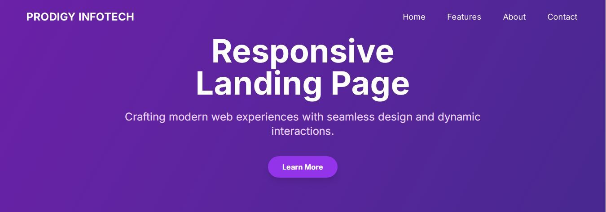
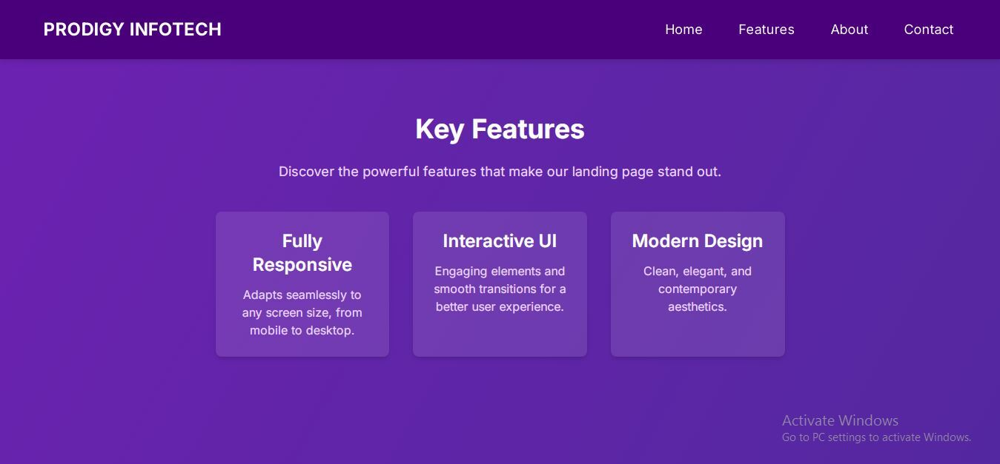
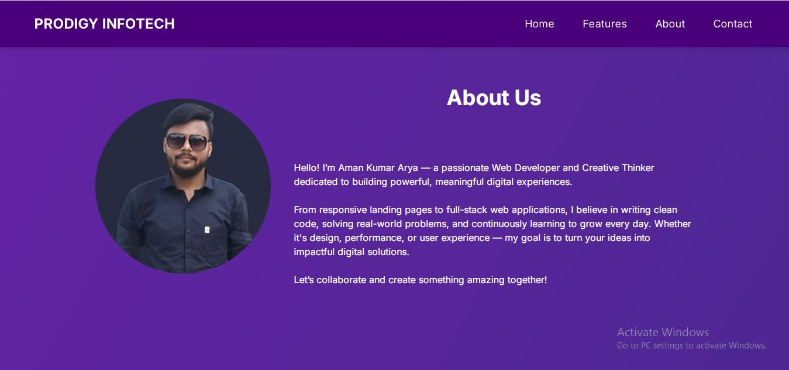
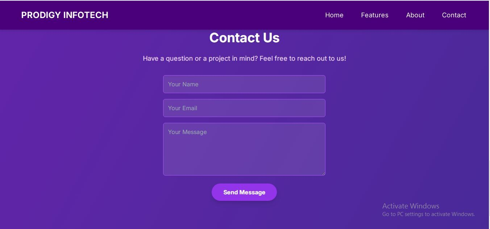

# 🌐 Responsive Landing Page – TPRODIGY_WD_01 @ Prodigy Infotech

Welcome to my **Responsive Landing Page** project, proudly crafted as part of **PRODIGY_WD_01* during my web development internship at **Prodigy Infotech**. This project is a graceful blend of structure, interactivity, and design, built using **HTML**, **CSS**, and **JavaScript**.

## 📑 Table of Contents

* [About](#about)
* [Features](#features)
* [Sections](#sections)
* [About Me](#about-me)
* [Contact](#contact)
* [Screenshots](#screenshots)
* [Technologies Used](#technologies-used)
* [How to Run Locally](#how-to-run-locally)
* [License](#license)

---

## 📖 About

This landing page showcases a modern, responsive design with smooth JavaScript interactivity. Whether viewed on desktop or mobile, the layout adjusts beautifully. From animated elements to structured content blocks, every feature is built to reflect real-world web standards.

---

## 🎯 Features

* 🔹 Fully responsive across devices
* 🔹 Interactive navigation with JavaScript
* 🔹 Smooth scrolling for seamless user experience
* 🔹 Elegant layout with modern design principles
* 🔹 User-friendly interface and minimalist aesthetic

---

## 🧩 Sections

The landing page includes the following core sections in the header navigation:

* 🏠 **Home** – Engaging welcome and introduction
* ⚙️ **Features** – Highlights key offerings and value
* 📘 **About** – A brief story about the creator
* 📞 **Contact** – Ways to connect and collaborate

---

## 👨‍💻 About Me

>Hello! I’m Aman Kumar Arya — a passionate Web Developer and Creative Thinker dedicated to building powerful, meaningful digital experiences.

From responsive landing pages to full-stack web applications, I believe in writing clean code, solving real-world problems, and continuously learning to grow every day. Whether it's design, performance, or user experience, my goal is to turn your ideas into impactful digital solutions.

Let’s collaborate and create something amazing together!

## 📩 Contact

Let’s connect and build something amazing together:

* 💬 Instagram: [@i\_aman\_arya](https://www.instagram.com/i_aman_arya/?hl=en)
* 🐦 Twitter: [@aman\_arya\_a2](https://x.com/aman_arya_a2)
* 📘 Facebook: [@amanaryaji](https://www.facebook.com/amanaryaji)

## 📸 Screenshots

### Home Section

### Features Section

### About Section

### Contact Section

## 🛠️ Technologies Used

* HTML5
* CSS3
* JavaScript (Vanilla)
* Google Fonts (Poppins)
* Font Awesome Icons

## 🚀 How to Run Locally

To explore this project on your local machine, follow these steps:

1. Clone the repository:
   `git clone https://github.com/amanarya1311/Prodigy-Infotech.git`

2. Navigate to the project folder:
   `cd PRODIGY_WD_01

3. Open the `index.html` file in your browser:

   * Double-click the file, **or**
   * Right-click and choose "Open with" > preferred browser, **or**
   * Use **Live Server** in VS Code for dynamic development.

[Live Demo](https://amanarya1311.github.io/Prodigy-Infotech/PRODIGY_WD_01/)

## 📄 License

This project is licensed under the MIT License. See the [LICENSE](./License) file for full details.

