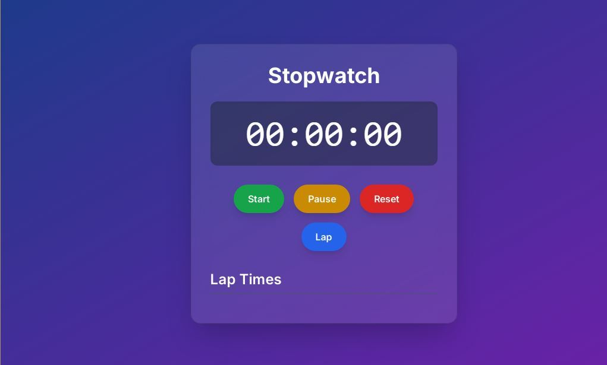

# ⏱️ Stopwatch – PRODIGY_WD_02 @ Prodigy Infotech

Welcome to my **Stopwatch** project, created as part of **PRODIGY_WD_02** during my web development internship at **Prodigy Infotech**. This project presents a simple yet fully functional stopwatch built using **HTML**, **CSS**, and **JavaScript**, demonstrating dynamic time-tracking logic and responsive design.

## 📑 Table of Contents
- [About](#about)
- [Features](#features)
- [Screenshots](#screenshots)
- [Technologies Used](#technologies-used)
- [How to Run Locally](#how-to-run-locally)
- [About Me](#about-me)
- [License](#license)

## 📖 About

This stopwatch functions just like a digital timer: you can start, stop, and reset the clock. It's a great example of how JavaScript can be used to manipulate time and control web elements dynamically. The layout is responsive and user-friendly, suitable for desktops and mobile devices alike.

## 🎯 Features

- ▶️ **Start** the stopwatch
- ⏸️ **Stop** to pause the time
- 🔁 **Reset** to clear the time
- 📱 Fully responsive across all screen sizes
- 🧩 Built with clean, minimal UI using HTML, CSS, and JavaScript

## 📸 Screenshots

### Stopwatch Interface  

## 🛠️ Technologies Used

- **HTML5** – For structuring the stopwatch layout  
- **CSS3** – For styling and layout responsiveness  
- **JavaScript** – For time tracking, event handling, and interactivity  

## 🚀 How to Run Locally

Follow the steps below to run this project on your local machine:

1. Clone the repository:  
    `git clone https://github.com/amanarya1311/Prodigy-Infotech.git`

2. Navigate to the stopwatch folder:  
   `cd PRODIGY_WD_03`

3. Open the `index.html` file in your browser:  
   - Double-click the file, **or**  
   - Right-click and choose "Open with" > your browser, **or**  
   - Use **Live Server** in VS Code for real-time viewing

[Live Demo](https://amanarya1311.github.io/Prodigy-Infotech/PRODIGY_WD_03/)

## 👨‍💻 About Me

> I am **Aman Kumar Arya**, a curious and committed web developer passionate about building functional and beautiful web interfaces. This stopwatch project highlights my growing experience with JavaScript logic and front-end precision.

## 📄 License

This project is licensed under the MIT License – see the [LICENSE](./License) file for more details.

