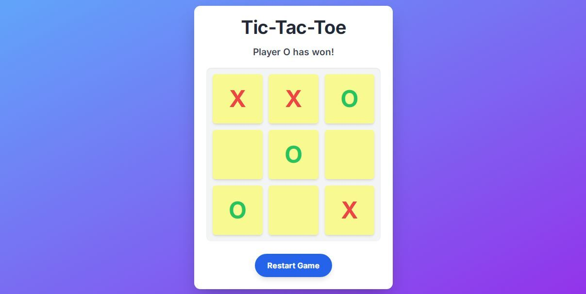

# ❌⭕ Tic Tac Toe Game – PRODIGY_WD_03 @ Prodigy Infotech

Welcome to my **Tic Tac Toe Game** project, developed as part of **PRODIGY_WD_03** during my web development internship at **Prodigy Infotech**. This interactive game is built using **HTML**, **CSS**, and **JavaScript**, blending logic and design into a classic 2-player challenge.

## 📑 Table of Contents
- [About](#about)
- [Features](#features)
- [Gameplay Rules](#gameplay-rules)
- [Screenshots](#screenshots)
- [Technologies Used](#technologies-used)
- [How to Run Locally](#how-to-run-locally)
- [About Me](#about-me)
- [License](#license)

## 📖 About

This web-based Tic Tac Toe game allows two players to take turns and compete on a 3×3 grid. The game logic is implemented in JavaScript with clear conditions for winning and draw scenarios. Clean design, responsive layout, and smooth interactions offer a delightful experience across devices.

## 🎯 Features

- 🎮 2-Player gameplay (X vs O)
- ✅ Win and Draw detection
- 🔄 Restart game option
- 📱 Fully responsive layout for mobile and desktop
- 🎨 Visually pleasing interface with subtle effects

## 🕹️ Gameplay Rules

- Player 1 is **X**, Player 2 is **O**
- Players take turns to mark an empty cell
- First to align 3 marks (horizontally, vertically, or diagonally) wins
- If all cells are filled without a winner, the game ends in a draw
- Use the **Restart** button to play again

## 📸 Screenshots

### Game Board  

## 🛠️ Technologies Used

- **HTML5** – Page structure and grid layout  
- **CSS3** – Styling, hover effects, and responsive design  
- **JavaScript** – Game logic, player switching, and result handling  

## 🚀 How to Run Locally

To enjoy the game locally on your system:

1. Clone the repository:  
  `git clone https://github.com/amanarya1311/Prodigy-Infotech.git`

2. Navigate to the Tic Tac Toe directory:  
   `cd PRODIGY_WD_03`

3. Open the `index.html` file in a browser:  
   - Double-click the file  
   - Or right-click and select "Open with" > browser  
   - Or use **Live Server** in VS Code

[Live Demo](https://amanarya1311.github.io/Prodigy-Infotech/PRODIGY_WD_02/)

## 👨‍💻 About Me

> I am **Aman Kumar Arya**, a creative coder and aspiring full stack developer. Through this fun and interactive project, I’ve sharpened my logic-building skills and front-end capabilities. It’s more than just a game—it's a symbol of code meeting creativity.

## 📄 License

This project is licensed under the MIT License – see the [LICENSE](./License) file for more details.

