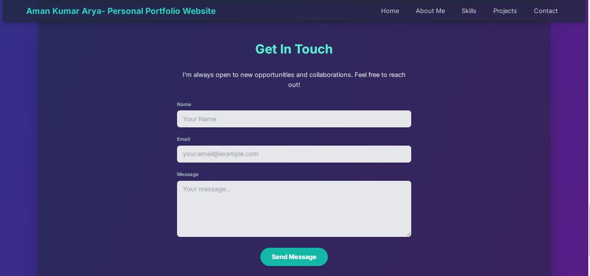

# 🌐 Personal Portfolio Website – PRODIGY_WD_04 @ Prodigy Infotech

Welcome to my **Personal Portfolio Website**, proudly created as *PRODIGY_WD_04** during my web development internship at **Prodigy Infotech**. This project is a complete front-end portfolio built using **HTML**, **CSS**, and **JavaScript**, showcasing my journey, skills, and projects with an elegant and responsive design.

## 📑 Table of Contents
- [About](#about)
- [Features](#features)
- [Website Sections](#website-sections)
- [Screenshots](#screenshots)
- [Technologies Used](#technologies-used)
- [How to Run Locally](#how-to-run-locally)
- [About Me](#about-me)
- [License](#license)

## 📖 About

This portfolio website serves as my digital identity, highlighting who I am, what I do, and how I build. It reflects my front-end skills, creative approach, and attention to responsive design. Every section is carefully structured to communicate my personal brand and professional work effectively.

## 🎯 Features

- 🌟 Clean and minimalistic design
- 🧑‍💻 Responsive layout for all devices
- ⚡ Smooth scroll navigation
- 💬 Functional contact form (static)
- 🎨 Engaging animations and transitions
- 📁 Organized project showcase

## 🧩 Website Sections

- **Home** – A hero section with my name, title, and brief intro  
- **About Me** – Who I am and what drives me, and also my education and experience.  
- **Skills** – My technical stack and tools I use  
- **Projects** – Live project previews with links  
- **Contact** – Ways to reach out to me  
- **Footer** – Social media icons and copyright  

## 📸 Screenshots

### Home Section  

### Skills Section  

### Projects Section  

### Contact Section  

### Footer Section  

## 🛠️ Technologies Used

- **HTML5** – Semantic layout structure  
- **CSS3** – Styling, animations, responsive layout  
- **JavaScript** – Navigation toggles, scroll behavior, and interactivity  

## 🚀 How to Run Locally

To view the portfolio on your local system:

1. Clone the repository:  
   `git clone https://github.com/amanarya1311/Prodigy-Infotech.git`

2. Navigate to the project folder:  
   `cd PRODIGY_WD_04`

3. Open the `index.html` file in your browser:  
   - Double-click to open, **or**  
   - Right-click and choose “Open with” > browser, **or**  
   - Use **Live Server** in VS Code for best results

[Live Demo](https://amanarya1311.github.io/Prodigy-Infotech/PRODIGY_WD_04/)

## 👨‍💻 About Me

> I’m **Aman Kumar Arya**, a detail-driven web developer with a creative mind and a problem-solving approach. This portfolio is not just a project—it's my professional signature, built with passion, precision, and purpose.

## 📄 License

This project is licensed under the MIT License – see the [LICENSE](./License) file for details.

