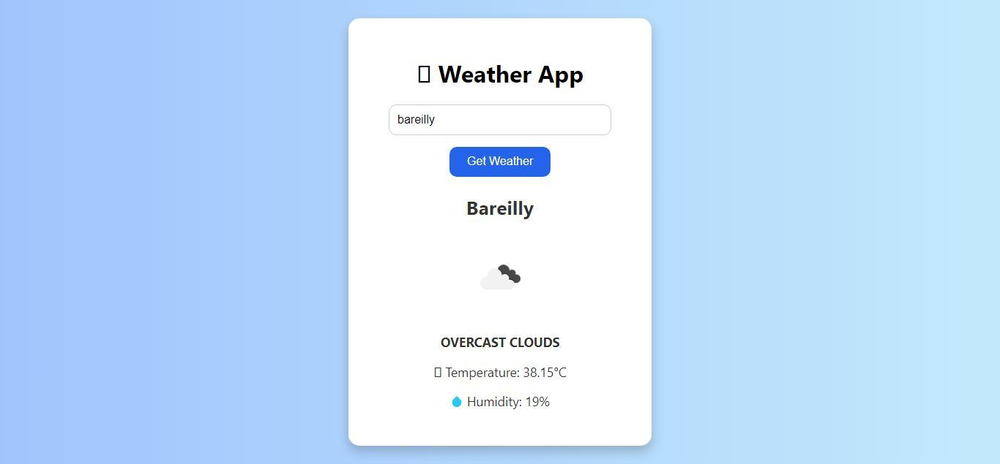

# ⛅ Weather App – PRODIGY_WD_05 @ Prodigy Infotech

Welcome to my **Weather App** project, created as part of **PRODIGY_WD_05** during my web development internship at **Prodigy Infotech**. This app is a clean and functional interface built using **HTML**, **CSS**, and **JavaScript**, allowing users to check real-time weather updates by entering a city name.

## 📑 Table of Contents
- [About](#about)
- [Features](#features)
- [How It Works](#how-it-works)
- [Screenshots](#screenshots)
- [Technologies Used](#technologies-used)
- [How to Run Locally](#how-to-run-locally)
- [About Me](#about-me)
- [License](#license)

## 📖 About

The Weather App fetches current weather data from an external API based on user input. With a responsive layout and clear presentation, users can easily view the temperature, weather condition, humidity, and wind speed for any city in the world.

## 🎯 Features

- 🌍 Search weather by city name
- 🌡️ Displays temperature in Celsius
- ☁️ Shows weather description (e.g., Clear, Rainy, Cloudy)
- 💧 Humidity and wind speed information
- 📱 Fully responsive design
- ⚡ Instant API-based results

## 🔧 How It Works

1. User enters a **city name** in the input field  
2. JavaScript fetches weather data using **OpenWeatherMap API**  
3. Data is dynamically displayed on the screen  
4. App updates UI without refreshing the page  

## 📸 Screenshots

### Search & Results View  

## 🛠️ Technologies Used

- **HTML5** – Page structure  
- **CSS3** – Styling and layout  
- **JavaScript** – API call, dynamic content rendering  
- **OpenWeatherMap API** – Live weather data  

## 🚀 How to Run Locally

To run this weather app on your local machine:

1. Clone the repository:  
  `git clone https://github.com/amanarya1311/Prodigy-Infotech.git`

2. Navigate to the weather app folder:  
  `cd PRODIGY_WD_05`

3. Open the `index.html` file in your browser:  
   - Double-click the file, or  
   - Right-click > “Open with” your preferred browser, or  
   - Use **Live Server** in VS Code

[Live Demo](https://amanarya1311.github.io/Prodigy-Infotech/PRODIGY_WD_05/)

## 👨‍💻 About Me

> I am **Aman Kumar Arya**, an aspiring web developer driven by curiosity and creativity. This Weather App is a reflection of my understanding of APIs, real-time data handling, and dynamic DOM manipulation using JavaScript.

## 📄 License

This project is licensed under the MIT License – see the [LICENSE](./License) file for more details.

